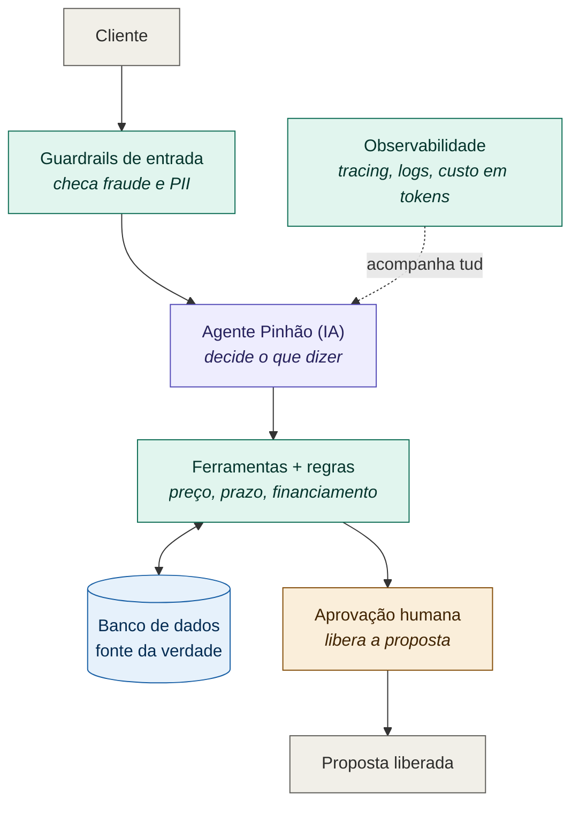

# Arquitetura — Eixo Sul / "Pinhão"

> Um desenho e um texto curto de como o sistema se sustenta. Princípio que costura tudo: **o modelo decide o que dizer; o código decide o que pode ser feito.** Case fictício, fins educacionais (ver disclaimer no PRD).

## Desenho

Legenda: **IA** (roxo) decide o que dizer · **Código** (verde) decide o que pode ser feito · **Humano** (âmbar) aprova o irreversível · **Banco** (azul) é a fonte da verdade.

## Como o sistema se sustenta (texto curto)

**Os componentes e o que cada um pode/não pode fazer**
- **Guardrails de entrada (código).** Primeira barreira: remove/mascara dados sensíveis do cliente antes de ir para a IA e barra tentativas de manipulação da conversa (prompt injection). *Não* interpreta intenção de venda — só protege.
- **Agente Pinhão (IA).** Conversa, entende a necessidade e *decide o que dizer*. Propõe ações chamando ferramentas. *Não* executa nada sozinho, *não* sabe preço/estoque de cabeça, *não* concede desconto.
- **Ferramentas + regras (código).** Onde vive a regra de negócio: buscar catálogo, consultar preço/estoque/prazo, simular financiamento, montar rascunho de proposta, enfileirar para aprovação. Cada uma valida o que a IA pediu antes de agir.
- **Banco de dados.** Fonte única da verdade do catálogo e do estado das conversas/aprovações. Todo número vem daqui.
- **Aprovação humana.** O portão. Nenhum documento chega ao cliente sem um humano da Eixo Sul liberar.
- **Observabilidade (transversal).** Registra cada turno, cada chamada de ferramenta e o custo em tokens por conversa.

**Onde ficam os dados**
No banco (fonte da verdade) para catálogo, preço, estoque, prazo e estado de aprovação. A IA só enxerga o que a ferramenta devolve — ela nunca é a dona do dado.

**Onde entra o humano**
No passo irreversível: a liberação da proposta ao cliente. Regra geral: *todo documento que sai passa por um humano.*

**O que acontece quando algo falha**
- Ferramenta não achou o dado → a IA **não inventa**; informa que vai verificar e, se preciso, escala para um humano.
- A IA tenta ação fora da regra (desconto acima do limite, liberar sem aprovação) → o código **bloqueia**.
- Ninguém aprova → a proposta **não sai**.
- Qualquer erro → fica na **trilha de auditoria**, para revisar o atendimento depois.

## Como isso responde aos medos do Seu Nei
Inventar preço → banco é a fonte da verdade. Ser enganado na conversa → regra no código, não no prompt. Documento sem revisão → aprovação humana obrigatória. Conta gigante → custo medido por conversa. Vazamento → PII tratada nos guardrails. Entender o que houve → tudo logado.
